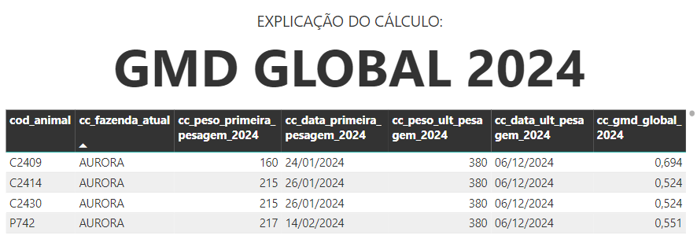

# **GMD GLOBAL 2024**  
O **GMD GLOBAL** (Ganho Médio Diário) mede o ganho de peso médio dos animais ao longo de um período. 

---

### **Explicação do Cálculo**  


O cálculo baseia-se na diferença entre o peso final e o peso inicial de cada animal, dividida pelo intervalo de tempo (em dias) entre as duas pesagens.  

**Fórmula Matemática:**  
$$
\text{gmd_global_2024} = \frac{(\text{peso_ult_pesagem_2024} - \text{peso_primeira_pesagem_2024})}{(\text{data_ult_pesagem_2024} - \text{data_primeira_pesagem_2024})}
$$


**Vídeo Explicativo**

<details>
  <summary>Ver explicação em vídeo</summary>
  <iframe width="560" height="315" src="https://www.youtube.com/embed/h9r_XIMBGjo?si=Q2waG-UgKj4mGTcr" title="YouTube video player" frameborder="0" allow="accelerometer; autoplay; clipboard-write; encrypted-media; gyroscope; picture-in-picture; web-share" referrerpolicy="strict-origin-when-cross-origin" allowfullscreen></iframe>
</details>

</br>


### **Fórmulas DAX**
A seguir estão detalhadas todas as fórmulas DAX utilizadas. 


#### Cálculo final
```dax
cc_gmd_global_2024 = 
SWITCH(
    TRUE()
    ,OR(
      ISBLANK('CalcInfosAnimais'[cc_peso_primeira_pesagem_2024])
      ,ISBLANK('CalcInfosAnimais'[cc_peso_ult_pesagem_2024])
      )
    ,BLANK()

    ,DIVIDE(
      ([cc_peso_ult_pesagem_2024] - [cc_peso_primeira_pesagem_2024])
      ,([cc_data_ult_pesagem_2024] - [cc_data_primeira_pesagem_2024])
      ,BLANK()
      )
    )
```

---
#### Etapas do cálculo
**1. Data da primeira pesagem 2024**  

```dax
cc_data_primeira_pesagem_2024 = 
VAR COD_CL = 'CalcInfosAnimais'[cod_animal]

RETURN 
CALCULATE(
    MIN('CalcAtividadeAnimai'[data]),
    FILTER(
        'CalcAtividadeAnimai',
        'CalcAtividadeAnimai'[cod_animal] = COD_CL 
        && ISNUMBER('CalcAtividadeAnimai'[peso])
        && 'CalcAtividadeAnimai'[data] >= DATE(2024, 01, 01)
        && 'CalcAtividadeAnimai'[data] <= DATE(2024, 12, 31)
))
```

**2. Peso da primeira pesagem 2024**

```dax
cc_peso_primeira_pesagem_2024 = 
VAR COD_CL = 'CalcInfosAnimais'[cod_animal]
VAR DATA_PRIMEIRA_PESAGEM_CL = 'CalcInfosAnimais'[cc_data_primeira_pesagem_2024]

RETURN 
CALCULATE(
    MAX('CalcAtividadeAnimai'[peso]),
    FILTER(
        'CalcAtividadeAnimai',
        'CalcAtividadeAnimai'[cod_animal] = COD_CL &&
        ISNUMBER('CalcAtividadeAnimai'[peso]) &&
        'CalcAtividadeAnimai'[data] = DATA_PRIMEIRA_PESAGEM_CL))

```

**3. Data da última pesagem 2024***

```dax
cc_data_ult_pesagem_2024 = 
VAR COD_CL = 'CalcInfosAnimais'[cod_animal]

RETURN 
CALCULATE(
    MAX('CalcAtividadeAnimai'[data]),
    FILTER(
        'CalcAtividadeAnimai',
        'CalcAtividadeAnimai'[cod_animal] = COD_CL 
        && ISNUMBER('CalcAtividadeAnimai'[peso])
        && 'CalcAtividadeAnimai'[data] <= DATE(2024, 12, 31)
        && 'CalcAtividadeAnimai'[data] >= DATE(2024, 01, 01)
))
```


**4. Peso da última pesagem 2024**

```dax
cc_peso_ult_pesagem_2024 = 
VAR COD_CL = 'CalcInfosAnimais'[cod_animal]
VAR DATA_ULT_PESAGEM_CL = 'CalcInfosAnimais'[cc_data_ult_pesagem_2024]

RETURN 
CALCULATE(
    MAX('CalcAtividadeAnimai'[peso]),
    FILTER(
        'CalcAtividadeAnimai',
        'CalcAtividadeAnimai'[cod_animal] = COD_CL &&
        ISNUMBER('CalcAtividadeAnimai'[peso]) &&
        'CalcAtividadeAnimai'[data] = DATA_ULT_PESAGEM_CL))
```
  


