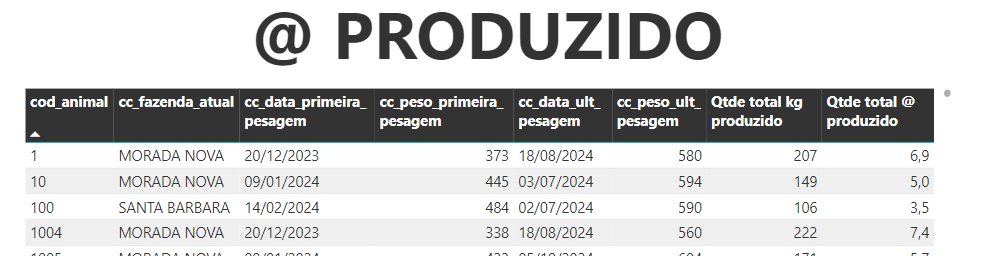

# **ARROBA PRODUZIDO**  
Cálculo que avalia qual o total de @ produzido desde o início da avaliação dos registros

---

### **Explicação do Cálculo**  



**Fórmula Matemática:**  
$$
\text{@_produzido} = \text{soma_peso_atual_rebanho} - \text{soma_peso_inicial_rebanho}
$$

Planilha de exemplo: [Clique aqui](https://docs.google.com/spreadsheets/d/1JiBz9C6E1ee0s5IDCQ8Qxre8Savf4JEkSIXCmAOZJw0/edit?gid=1323946559#gid=1323946559)

**Vídeo Explicativo**

<details>
  <summary>Ver explicação em vídeo</summary>
  
  <iframe width="560" height="315" src="LINK_VIDEO" 
  frameborder="0" allow="accelerometer; autoplay; clipboard-write; encrypted-media; gyroscope; picture-in-picture" allowfullscreen></iframe>
</details>
</br>


### **Fórmulas DAX**
A seguir estão detalhadas todas as fórmulas DAX utilizadas.


#### Cálculo final
```dax
Qtde total @ produzido = [Qtde total kg produzido] / [PESO DA @]
```

---
#### Etapas do cálculo
**1. Data primeira pesagem**  

```dax
cc_data_primeira_pesagem = 
VAR COD_CL = 'CalcInfosAnimais'[cod_animal]

RETURN 
CALCULATE(
    MIN('CalcAtividadeAnimai'[data]),
    FILTER(
        'CalcAtividadeAnimai',
        'CalcAtividadeAnimai'[cod_animal] = COD_CL 
        && ISNUMBER('CalcAtividadeAnimai'[peso])
))
```
**2. Peso primeira pesagem**  

```dax
cc_peso_primeira_pesagem = 
VAR COD_CL = 'CalcInfosAnimais'[cod_animal]
VAR DATA_PRIMEIRA_PESAGEM_CL = 'CalcInfosAnimais'[cc_data_primeira_pesagem]

RETURN 
CALCULATE(
    MAX('CalcAtividadeAnimai'[peso]),
    FILTER(
        'CalcAtividadeAnimai',
        'CalcAtividadeAnimai'[cod_animal] = COD_CL &&
        ISNUMBER('CalcAtividadeAnimai'[peso]) &&
        'CalcAtividadeAnimai'[data] = DATA_PRIMEIRA_PESAGEM_CL))

```

**3. Data última pesagem**  

```dax
cc_data_ult_pesagem = 
VAR COD_CL = 'CalcInfosAnimais'[cod_animal]

RETURN 
CALCULATE(
    MAX('CalcAtividadeAnimai'[data]),
    FILTER(
        'CalcAtividadeAnimai',
        'CalcAtividadeAnimai'[cod_animal] = COD_CL 
        && ISNUMBER('CalcAtividadeAnimai'[peso]))
)
```
**4. Peso última pesagem**  

```dax
cc_peso_ult_pesagem = 
VAR COD_CL = 'CalcInfosAnimais'[cod_animal]
VAR DATA_ULT_PESAGEM_CL = 'CalcInfosAnimais'[cc_data_ult_pesagem]

RETURN 
CALCULATE(
    MAX('CalcAtividadeAnimai'[peso]),
    FILTER(
        'CalcAtividadeAnimai',
        'CalcAtividadeAnimai'[cod_animal] = COD_CL &&
        ISNUMBER('CalcAtividadeAnimai'[peso]) &&
        'CalcAtividadeAnimai'[data] = DATA_ULT_PESAGEM_CL))
```
**5. Cálcular o número de Kg ganhos**  

```dax
Qtde total kg produzido = SUMX(CalcInfosAnimais, CalcInfosAnimais[cc_peso_ult_pesagem] - CalcInfosAnimais[cc_peso_primeira_pesagem])
```


